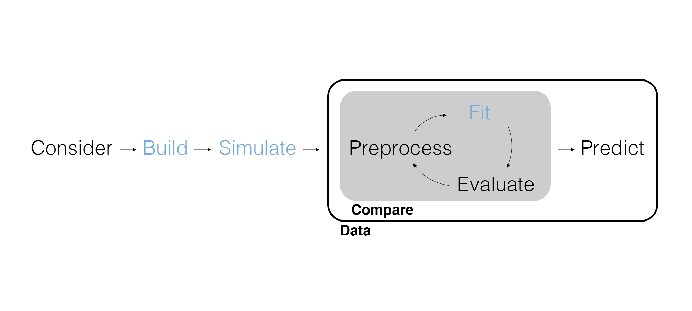
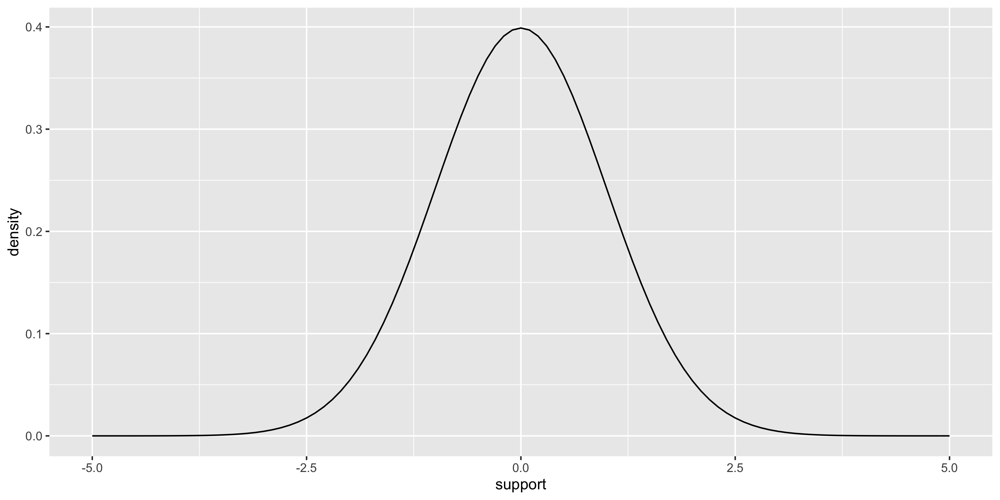
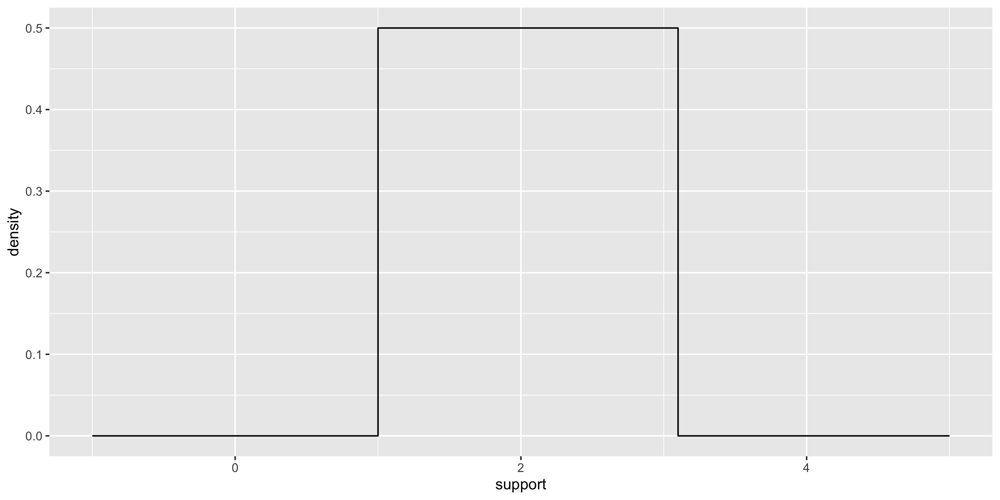
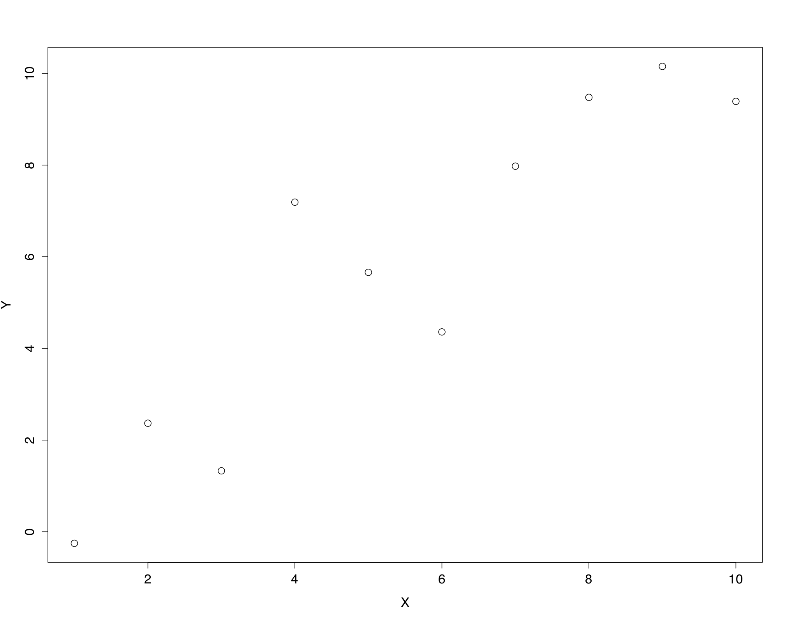
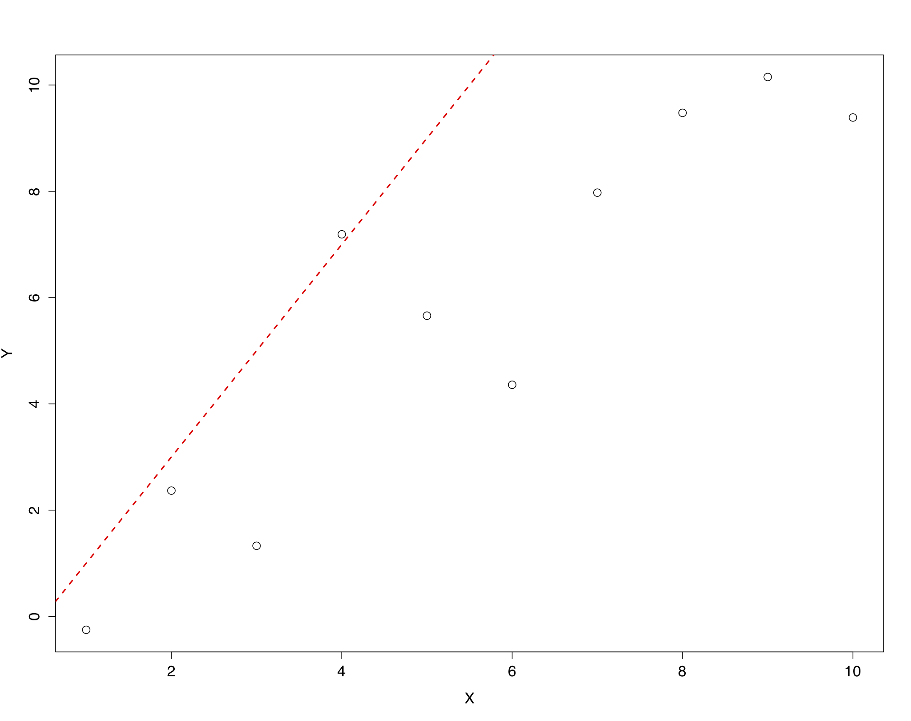
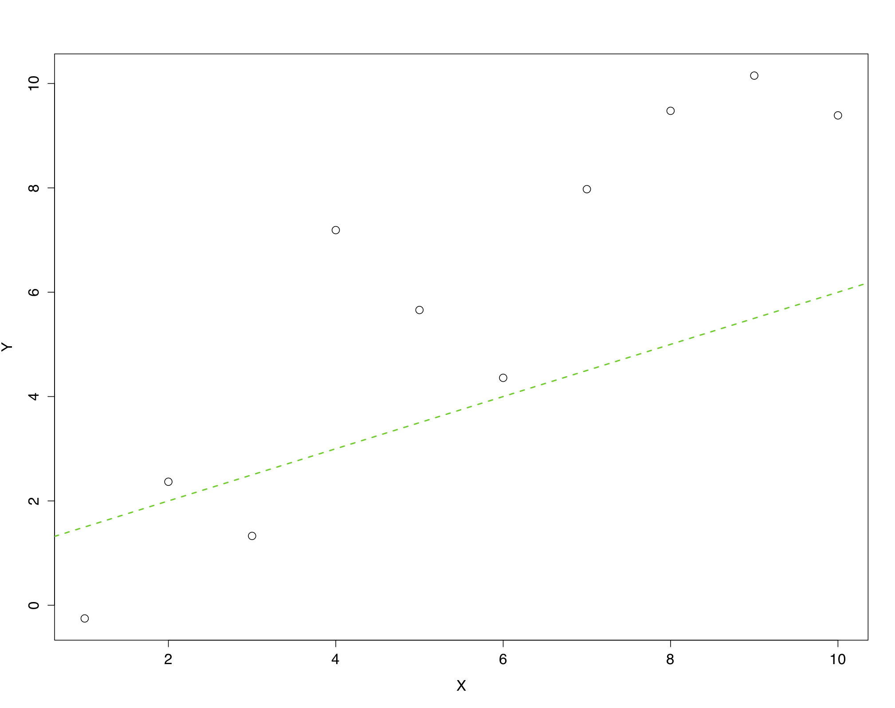
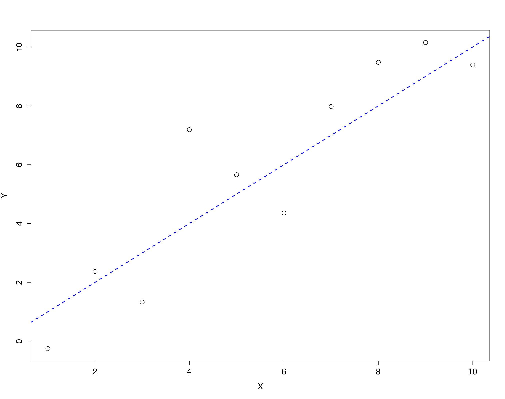
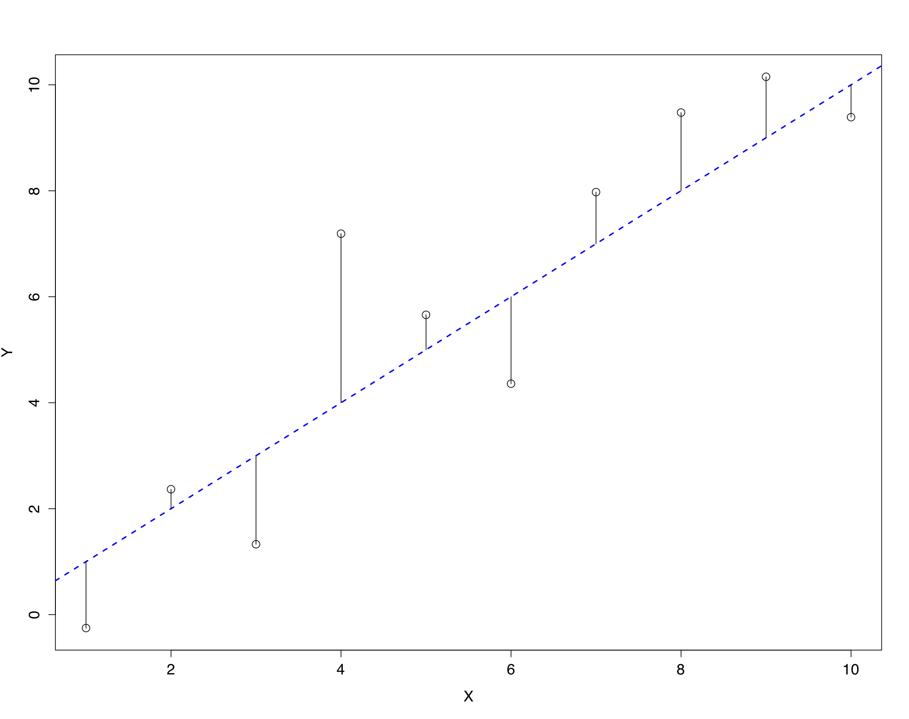
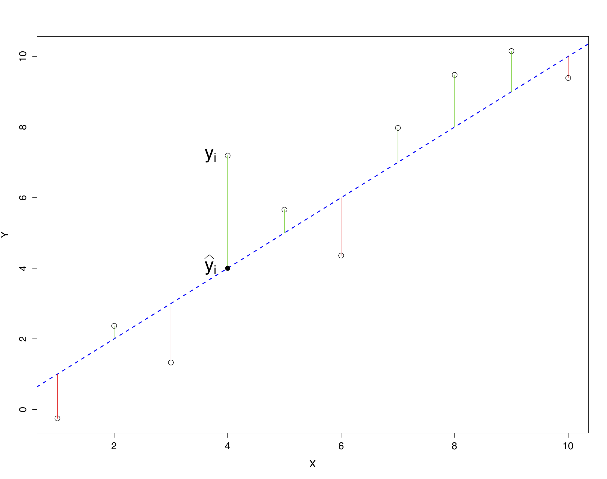
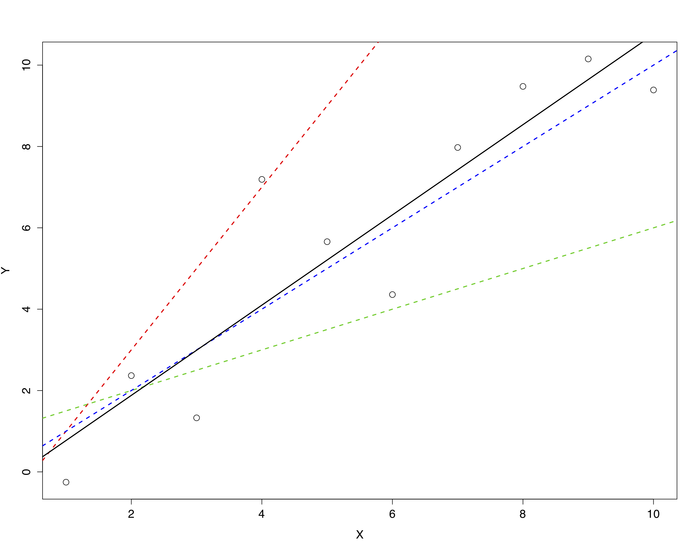

## Marketing Analytics Process

<center>
{width="900px"}
</center>

## Inferential Modeling Workflow

<center>
{width=900px}
</center>

---

{width=500px}

## Linear Models

Last time we translated a story about the *data generating process* into a statistical model. In general, a model looks like this:

$$y = \beta_0 + \beta_1 x + \epsilon$$

Because $y = \beta_0 + \beta_1 x$ is a linear equation, adding $\epsilon$ makes this a **linear model**.

- $y$ is the **outcome** variable (a.k.a., response or dependent variable).
- $x$ is an **explanatory** variable (a.k.a., a predictor or independent variable, feature, or covariate).
- $\beta_0$ is the **intercept** parameter.
- $\beta_1$ is a **slope** parameter.
- $\epsilon$ is the *error* term.

---

But what kind of *error*?

If the error includes every other explanatory variable beyond the `x` that we've included in the model, what does the sum of all of their effects look like?

We have to assume $\epsilon$ is *distributed* a certain way, typically:

$$\epsilon \sim Normal(0, 1)$$

---

The **normal distribution**, and every other **probability distribution**, has a few essential components:

- The **support** are the values on the x-axis that have non-zero probability.
- The **probability** of some subset of the support is the associated area under the curve on the y-axis.

<center>
{width=750px}
</center>

---

The normal distribution is one of many *probability distributions*. Here's the **uniform distribution**.

- What is the support?
- What value in the support is most likely?

<center>
{width=750px}
</center>

---

Okay, but *why* should we use a linear model and assume $\epsilon \sim Normal(0, 1)$?

- A linear model is simple but a good assumption when we don't know a lot about the data generating process. It says the outcome variable is the result of summing up the effects of the explanatory variable(s).
- The normal distribution shows up a lot in nature and, like the linear model, is a good assumption when we don't know a lot about the data generating process. It says the effects of all the variables we don't include in the model add up to something that looks like normal error.

A linear model with normal error and a continuous outcome $y$ is known as a **regression**.

## Simulating Data

We now have a complete statistical model of the data generating process:

$$y = \beta_0 + \beta_1 x + \epsilon, \text{ where } \epsilon \sim Normal(0, 1)$$

Remember that the data generating process is the unobserved process that generates the data, so before we work with real data where we never know the data generating process, we can assume that our model *is* the data generating process, *choose* values for the parameters, and generate or **simulate** data using the model.

Why? To start with, we can prepare our data analysis before getting real data.

---

How do we simulate data from this?

$$y = \beta_0 + \beta_1 x + \epsilon, \text{ where } \epsilon \sim Normal(0, 1)$$

```{r message=FALSE}
# Load packages.
library(tidyverse)

# Set the randomization seed to simulate the same data each time.
set.seed(42)

# Set the parameter values.
beta0 <- 3
beta1 <- 7

# Simulate data.
sim_data <- tibble(
  x = runif(100, min = 0, max = 7),
  y = beta0 + beta1 * x + rnorm(100, mean = 0, sd = 3)
)
```

---

Whenever we are using randomization, *for example*, when simulating data or running a model that relies on randomization, we want to use `set.seed()` so we can get the same results every time we render.

```{r}
# Random number are, well, random.
rnorm(1)
rnorm(1)
rnorm(1)
```

---

```{r}
# But using set.seed() we at least start at the *same* random number each time.
set.seed(42)
rnorm(1)

set.seed(42)
rnorm(1)

set.seed(42)
rnorm(1)
```

## Plotting Our Simulated Data

```{r}
sim_data |> 
  ggplot(aes(x = x, y = y)) +
  geom_point()
```

## Parameter Estimates

Okay, what have we talked about so far?

- We use inferential models to understand a process we don't observe.
- We translate a story about this data generating process into building a statistical model.
- If we have a continuous outcome $y$, a regression is a good model to start with.
- We can simulate data from this model to prepare our analysis before getting real data.

Our goal is to use the model to **estimate** the unobserved parameters from the data (i.e., make our best guess).

In other words, an inferential model extracts **parameter estimates** from the data to inform our managerial decision.

## Estimating $\beta_0$ and $\beta_1$

<center>
{width=600px}
</center>

## Finding the Best Line

<center>
{width=600px}
</center>

## Finding the Best Line

<center>
{width=600px}
</center>

## Finding the Best Line

<center>
{width=600px}
</center>

## Finding the Best Line

<center>
{width=600px}
</center>

## Minimizing the Sum of Squared Residuals

The best line should be the one that makes **the sum** of the vertical bars as **small as possible**.

The vertical bars are called **residuals**, and represent the distance between the data $y$ and a particular line.

Residuals can be positive and negative, so we make the sum of the **squared residuals** as small as possible.

## Minimizing the Sum of Squared Residuals

<center>
{width=600px}
</center>

---

<center>
{width=600px}
</center>

## Using tidymodels

The **tidymodels** framework is a collection of packages for modeling using tidyverse principles. The goal is to provide the same consistency and ease-of-use for modeling that the tidyverse provides for importing, wrangling, visualizing, and reporting data.

```{r}
# Load packages.
library(tidymodels)
```

## Specify the Model Type and Engine

In the tidymodels framework, we specify the model **type** and then set the **engine** we'd like to estimate the model with. The engine is either another R package that likely requires its own unique syntax or an entirely different modeling language.

This allows us to use a variety of modeling packages and languages while keeping the same syntax.

```{r}
# Specify the model type and engine.
linear_reg() |> 
  set_engine("lm")
```

---

<center>
{width=900px}
</center>

## Fit the Model

When we **fit** a linear model (a.k.a., training, calibrating, or estimating the model) we are finding the line of best fit and getting parameter estimates.

To do this the `fit()` function uses **formula** notation where the model is specified with `outcome ~ explanatory variable(s)`.

```{r}
# Fit the model.
(model_1 <- linear_reg() |> 
  set_engine("lm") |> 
  fit(y ~ x, data = sim_data))
```

## View Model Results

```{r}
model_1 |>
  tidy()
```

## Wrapping Up

*Summary*

- Discussed linear models.
- Used a linear model to simulate data.
- Walked through parameter estimation for a linear model.
- Introduced tidymodels to fit models.

*Next Time*

- Evaluating model fit.

*Supplementary Material*

- *Tidy Modeling with R* Chapter 6.1

*Artwork by @allison_horst*

## Exercise 9

1. Simulate sales data as a function of promotional spend using a regression. Name the observed variables `sales` and `promotional_spend`. Use different parameter values than we did in class.
2. Visualize the simulated data and add the best fitting *line* using `geom_smooth()`.
3. Fit the regression using {tidymodels}.
4. Render the Quarto document into Word and upload to Canvas.

